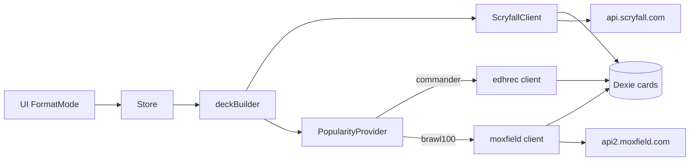

# ADR: modo Brawl 100 (fase 1) — Manafoundry fork

## Contexto
Fork `LuisMiguelMedina/mtg-commander-deck-generator` (flujo Commander: Scryfall + EDHREC + deckBuilder + Dexie).
VoBo Luis: fase 1 = solo Brawl 100 (ex-Historic Arena); legalidad Scryfall `legalities.brawl`; popularidad vía Moxfield no oficial; Standard Brawl 60 = fase 2.

## Decisión
Extender el producto con un **FormatMode**, no un fork del generador.

### Componentes
1. **FormatMode** (`commander` | `brawl100`; reserva `standardBrawl60`)
   - Reglas Brawl 100: 1+99, singleton, color identity, comandante legendario/PW/(Vehicle|Spacecraft elegible), 25 vida 1v1, sin commander damage (UI/copy; no simulación de daño en fase 1 salvo que requisitos lo pidan).
2. **ScryfallClient** (existente)
   - Gate de pool: `legalities.brawl === 'legal'`; reutilizar `arenaOnly`/`game:arena` si aplica a Arena.
   - Rate limiter + cache Dexie de cartas sin cambio de contrato.
3. **PopularityProvider** (nuevo puerto)
   - Commander hoy: implementación EDHREC.
   - Brawl 100: implementación Moxfield (`api2.moxfield.com/v2/decks/search`, `fmt=brawl` y mapeo validado de `historicBrawl`).
   - Salida normalizada: inclusion %, sample size, curva/tipos si el JSON lo permite; si no, solo inclusion por carta + numDecks.
4. **MoxfieldClient** (nuevo, espejo de `services/edhrec`)
   - Cola ≤1 req/s, retry/backoff 429/5xx, timeout, User-Agent estable.
   - Cache IndexedDB (nueva store `moxfieldResponses` o genérica `externalResponses`) TTL ~7–14d + techo de entradas.
   - Feature flag: si falla/403/CF → `DeckDataSource: 'scryfall'` (ya existe).
5. **deckBuilder**
   - Consume PopularityProvider; sin ifs de formato en el núcleo más allá de size/singleton/legalidad.
6. **UI/store**
   - Selector de modo; `DeckFormatConfig` Brawl 100; themes EDHREC ocultos/deshabilitados en Brawl salvo datos Moxfield análogos.

### Diagrama

### Alternativas descartadas
- Cliente arenabrawldb / BrawlForge / BrawlHub (VoBo).
- Duplicar `deckGenerator` por modo (costo de mantenimiento).
- Scraping HTML Moxfield (peor ToS/fragile que JSON search).

## Consecuencias
- Fase 2 (standardbrawl 60): nuevo FormatMode + reglas; mismo puerto PopularityProvider.
- Dependencia frágil de API no oficial Moxfield; degradación obligatoria.
- Trabajo nuevo acotado a puerto + cliente + reglas + UI mode; reutiliza Scryfall/cache/deckBuilder.

## Riesgos rendimiento / ToS
| Riesgo | Mitigación |
|--------|------------|
| ToS Moxfield (API no pública; permiso vía support) | Flag off por defecto hasta VoBo/contacto; solo decks públicos; sin credenciales de usuario |
| Cloudflare / 403 / cf_clearance | Tratar como outage; degradar a Scryfall; no automatizar bypass de CF |
| Rate limit no documentado | ≤1 rps, cache agresivo, paginar poco, no fan-out por carta |
| `historicBrawl` vs `brawl` | Spike de mapeo antes de requisitos finales; documentar source tag en meta |
| Comandantes con pocos mazos | Umbral min sample → fallback Scryfall; UI “datos limitados” |
| Tope 10% rate limit equipo PM | Presupuesto: cache hit ratio alto; spike Moxfield en horario bajo; sin backfill masivo en CI |

## Criterio listo → requisitos / QA PBI
- [ ] Tabla FormatMode + reglas Brawl 100 cerrada (este ADR VoBo'd)
- [ ] Contrato PopularityProvider + shape mínimo de inclusión
- [ ] Decisión Luis: Moxfield on (con/sin email a support) vs Scryfall-only hasta permiso
- [ ] Spike validado: search `fmt=brawl` vs `historicBrawl` → Brawl 100 Arena (muestra N comandantes)
- [ ] Degradación documentada (sin popularidad → `scryfall`)
- [ ] Extension point `standardBrawl60` nombrado, fuera de alcance implementación

## Fuera de alcance fase 1
Standard Brawl 60; implementación código; CloudAgent; bypass Cloudflare.
